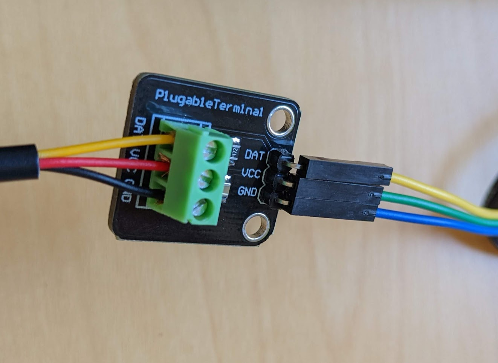
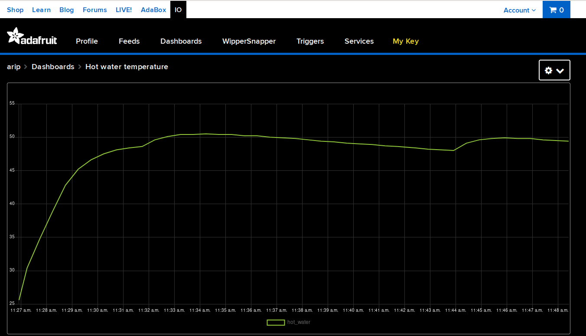

## Water pipe temperature sensor with ESPHome and Adafruit IO

This device measures the temperature of the hot water pipe coming out of my water heater and sends the data to Adafruit IO to be displayed on a chart.

### Equipment needed
* DS18B20 temperature sensor. I used [this kit](https://smile.amazon.com/gp/product/B09NVWNGLQ/) since it seemed easiest to use, but any other kit with the same sensor should work.
* [D1 mini](https://www.wemos.cc/en/latest/d1/d1_mini.html) with USB cable and charger. I chose this one because it was super cheap and relatively easy to use. Any ESP8266 device that works with ESPHome should be fine, as long as the configuration file contains the right board name.
* Soldering iron & solder

### Hardware Setup
* Solder the male pin headers onto the D1 mini
* Connect the sensor wires and jumper wires to the terminal block like so:

* Connect the jumper wires to the ESP board like so:
  * Blue: Ground
  * Green: 3V3
  * Yellow: D5
* Connect the USB cable from the ESP board to your computer

### Software Setup
* [Install ESPHome](https://esphome.io/guides/installing_esphome.html).
* Clone this repository from GitHub
* Open your local directory where you checked out this repository
* Copy [secrets.yaml.example](secrets.yaml.example) to `secrets.yaml` and edit it to fill in your WiFi network information and [Adafruit IO](https://io.adafruit.com/) account information.
* Run this command: `esphome run waterheater.yaml`
* Your ESP device should now be sensing temperature and you should now see it in your feeds on Adafruit IO!

